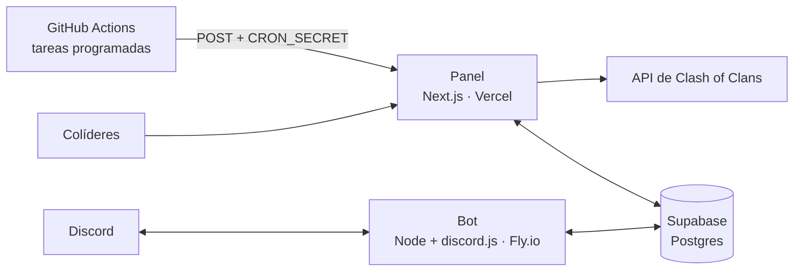

# Añakleta

Panel de gestión y bot de Discord para un clan de Clash of Clans. Los colíderes gestionan el clan desde un panel privado (miembros, guerras, liga y avisos), y un bot se encarga del trabajo repetitivo en Discord. Todo se conecta a la API del juego y a una base de datos en Supabase, con tareas programadas.

## Qué hace

- **Panel:** miembros con su historial y sus cuentas vinculadas, actividad y rachas, guerras ataque a ataque, avisos y sanciones, inscripciones y temporadas de liga, rankings y raids de la capital. Además, un editor de normas y un compositor de anuncios para Discord.
- **Bot:** inscripción en la liga escribiendo con naturalidad («me apunto») o con comandos, bienvenida por mensaje privado, y apodo y roles asignados según la cuenta del juego.

## Arquitectura



- El **panel** (Next.js 16 con Server Actions) y el **bot** (Node con discord.js, conectado 24/7 al gateway de Discord) se despliegan por separado y **solo se comunican a través de la base de datos**. Cada uno se puede actualizar o reiniciar sin afectar al otro.
- **No hay colas.** Las tareas periódicas las lanza GitHub Actions contra rutas del panel protegidas con `CRON_SECRET`. Todas son idempotentes: repetir una ejecución nunca duplica nada.

| Tarea | Cuándo (UTC) | Ruta |
| --- | --- | --- |
| Foto del clan | cada 6 horas | `/api/snapshot` |
| Captura de guerra y recordatorios en Discord | cada hora | `/api/war-reminder` |
| Liga (CWL): inscripciones y avisos | cada día a las 09:00 | `/api/cwl-cron` |
| Roles de ayuntamiento (TH) en Discord | cada día a las 08:00 | `/api/th-roles` |

El bot se despliega en Fly.io con su propio workflow (`bot-deploy.yml`).

## Estructura

```text
app/          Panel (App Router): páginas, Server Actions y las rutas de /api para las tareas
lib/          Lógica del dominio: guerras, liga, sanciones, historial, API del juego, Discord
components/   Componentes de la interfaz
bot/          Bot de Discord, con su propio README para desplegarlo
supabase/     Esquema de la base de datos y sus ampliaciones, en SQL
.github/      Tareas programadas y despliegue del bot
```

## Puesta en marcha

Hace falta Node 20 o superior, un proyecto de [Supabase](https://supabase.com), un token de la [API de Clash of Clans](https://developer.clashofclans.com) y una aplicación de Discord con su bot.

1. **Base de datos.** En Supabase → SQL Editor, ejecuta `supabase/schema.sql` y después el resto de ficheros de `supabase/`, que amplían el esquema base. `cwl_seed_julio.sql` son datos de prueba y no hace falta.
2. **Variables de entorno.** Crea `.env.local` en la raíz:

   | Variable | Para qué |
   | --- | --- |
   | `NEXT_PUBLIC_SUPABASE_URL`, `NEXT_PUBLIC_SUPABASE_PUBLISHABLE_KEY` | Conexión del panel con Supabase |
   | `SUPABASE_SECRET_KEY` | Acceso de servidor a la base de datos |
   | `COC_API_BASE_URL`, `COC_API_TOKEN`, `COC_CLAN_TAG` | API del juego y el clan que se gestiona |
   | `CRON_SECRET` | Protege las rutas que lanzan las tareas |
   | `APP_URL` | URL pública del panel |
   | `LEADER_EMAIL` | Cuenta del líder, la única que ve el registro de accesos |
   | `DISCORD_BOT_TOKEN`, `DISCORD_GUILD_ID`, `DISCORD_CHANNEL_ID` | Servidor y canal de Discord para los avisos |
   | `CWL_ANNOUNCE_CHANNEL_ID`, `CWL_LIST_CHANNEL_ID`, `CWL_ROLE_ID`, `CLAN_ROLE_ID`, `WELCOME_CHANNEL_ID` | Canales y roles de la liga y de la bienvenida |

3. **Arranque.**

   ```bash
   npm install
   npm run dev
   ```

   El panel queda en `http://localhost:3000`.

El bot tiene sus propias variables (`bot/.env.example`) y sus pasos de despliegue en [`bot/README.md`](bot/README.md). El reconocimiento de mensajes en texto libre tiene tests: `cd bot && npm test`.

## Aviso

Añakleta es un proyecto de fans: no es oficial ni está respaldado por Supercell. Más información en su [política de contenido de fans](https://supercell.com/en/fan-content-policy/).
